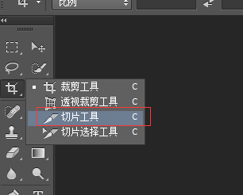

> 第01阶段.WEB基础：css-day05笔记-清除浮动&学成网布局准备工作


# 一. 清除浮动

## 1. 为什么要清除浮动

**因为父级盒子很多情况下，不方便给高度**，但是子盒子浮动就不占有位置，最后父级盒子高度为0，就影响了后面的标准流盒子。


- 总结：
  - 由于浮动元素不再占用原文档流的位置，所以它会对后面的元素排版产生影响
  - 准确地说，并不是清除浮动，而是**清除掉浮动后造成的影响**

## 2. 清除浮动本质

**听pink老师说清除浮动本质：**

​	**清除浮动主要为了解决父级元素因为子级浮动引起内部高度为0 的问题。清除浮动之后， 父级就会根据浮动的子盒子自动检测高度。父级有了高度，就不会影响下面的标准流了**

## 3. 清除浮动的方法（重点）

在CSS中，clear属性用于清除浮动，在这里，我们先记住清除浮动的方法，具体的原理，等我们学完css会再回头分析。

- 语法：

```
选择器{clear:属性值;}   clear 清除  
```

| 属性值   | 描述                    |
| ----- | --------------------- |
| left  | 不允许左侧有浮动元素（清除左侧浮动的影响） |
| right | 不允许右侧有浮动元素（清除右侧浮动的影响） |
| both  | 同时清除左右两侧浮动的影响         |

但是我们实际工作中， 几乎只用 clear: both;

### 1) 额外标签法（隔墙法）

```html
这是W3C推荐的做法。通过在浮动元素末尾添加一个空的标签
例如 <div style=”clear:both”></div>，或则其他标签br等亦可。
```

- 优点： 通俗易懂，书写方便
- 缺点： 添加许多无意义的标签，结构化较差。

### 2) 父级添加overflow属性方法

```css
可以给父级添加： overflow为 hidden| auto| scroll  都可以实现。
```

优点：  代码简洁

缺点：  内容增多时候容易造成不会自动换行导致内容被隐藏掉，无法显示需要溢出的元素。

### 3) 使用after伪元素清除浮动

**:after 方式为空元素额外标签法的<u>升级版</u>，好处是不用单独加标签了** 

使用方法：

```css
/* 1、使用after伪元素清除浮动 */
.clearfix:after {  
	content: ""; 
	display: block; 
	height: 0;   
	visibility: hidden; 
	clear: both; 
}   

/* IE6、7 专有 */
.clearfix {
	*zoom: 1;
}   
```

- 优点： 符合闭合浮动思想  结构语义化正确
- 缺点： 由于IE6-7不支持:after，使用 zoom:1触发 hasLayout。
- 代表网站： 百度、淘宝网、网易等


### 4) 使用双伪元素清除浮动

使用方法：

```css
/* 使用双伪元素清除浮动 */
.clearfix:before,.clearfix:after { 
	content:"";
	display:table; 
}
.clearfix:after {
	clear:both;
}
.clearfix {
	*zoom:1;
}
```

- 优点：  代码更简洁

- 缺点：  由于IE6-7不支持:after，使用 zoom:1触发 hasLayout。

- 代表网站： 小米、腾讯等

## 4. 清除浮动总结

**pink老师告诉你我们以后什么时候用清除浮动呢？**

**使用清楚浮动的情景：**

1. 父级没高度
2. 子盒子浮动了
3. 影响下面布局了，我们就应该清除浮动了。

| 清除浮动的方式            | 优点        | 缺点                     |
| ------------------ | :-------- | :--------------------- |
| 额外标签法（隔墙法）         | 通俗易懂，书写方便 | 添加许多无意义的标签，结构化较差。      |
| 父级overflow:hidden; | 书写简单      | 溢出隐藏                   |
| 父级after伪元素         | 结构语义化正确   | 由于IE6-7不支持:after，兼容性问题 |
| 父级双伪元素             | 结构语义化正确   | 由于IE6-7不支持:after，兼容性问题 |

**后面两种伪元素清除浮动，大家暂且会使用就好， 深入原理，我们后面学完伪元素再讲。**


# 二. Photoshop 切图

**常见的图片格式**

```
1. jpg图像格式： 
JPEG（.JPG）对色彩的信息保留较好，高清，颜色较多，我们产品类的图片经常用jpg格式的
2. gif图像格式：
GIF格式最多只能储存256色，所以通常用来显示简单图形及字体，但是可以保存透明背景和动画效果
3. png图像格式
是一种新兴的网络图形格式，结合了GIF和JPEG的优点，具有存储形式丰富的特点，能够保持透明背景
4. PSD图像格式
PSD格式是Photoshop的专用格式，里面可以存放图层、通道、遮罩等多种设计草稿。 
```

PS切图   可以 分为   利用切片工具切图 以及   利用PS的插件快速切图。

## 1 PS切片工具

 


ps切图片，分两大步：

### **1) 用切片选中图片**

* 利用切片工具手动划出

* 选中某个图层------**图层菜单---新建基于图层的切片**，创建切片，再导出

* **利用辅助线 来切图 --**    基于参考线的切片 

   

    

   

### **2) 导出切片**

  文件菜单   -- 存储为web设备所用格式 ----   选择  我们要的图片格式 ----  点存储  ---   **别忘了选择“选中的切片”**

### 清除参考线/切片

视图菜单-- 清除 辅助线/ 清除切片

## 2. 切图插件

Cutterman是一款运行在photoshop中的插件，能够自动将你需要的图层进行输出， 以替代传统的手工 "导出web所用格式" 以及使用切片工具进行挨个切图的繁琐流程。 它支持各种各样的图片尺寸、格式、形态输出，方便你在pc、ios、Android等端上使用。 它不需要你记住一堆的语法、规则，纯点击操作，方便、快捷，易于上手。

官网: http://www.cutterman.cn/zh/cutterman

注意： **cutterman插件要求你的ps 必须是完整版**，不能是绿色版，所以大家需要从新安装完整版本。


#   三、学成在线页面制作

### 学习目标

- **理解**
  - 能够说写单页面我们基本的流程
  - 能说出常见的css初始化语句
  - **能说出我们CSS属性书写顺序**
- **应用**
  - 能利用ps切图
  - 能引入外部样式表
  - 能把psd文件转换为html页面

学成在线的目的就是为了串联前面的所有知识。来一个春晚大联欢。

**pink老师：**

取义**学有所成**，为师之期望，君等成才者也，故曰学成网是也~~

## 1. 前期准备

### 1) 前期准备素材

- 学成在线PSD源文件
- 开发工具  =  PS（切图） +  sublime（代码） + chrome（测试）

### 2) 前期准备工作

欲先善其事，必先利其器。 先把我们的前期准备工作做好， 我们本次采取结构与样式相分离思想。

1. 创建 study 目录文件夹 (用于存放我们这个页面的相关内容)
2. study目录内新建images 文件夹 用于保存图片。
3. 新建index.html 首页html 文件（以后我们的网站首页统一规定为index.html)
4. 新建style.css 样式文件。 我们本次采用外链样式表。
5. 将样式引入到我们HTML页面文件中。
6. 样式表写入 清除内外边距样式，来检测样式表是否引入成功。

## 2. CSS属性书写顺序（重点）

建议遵循以下顺序：

1. 布局定位属性：display / position / float / clear / visibility / overflow（建议 display 第一个写，毕竟关系到模式）
2. 自身属性：width / height / margin / padding / border / background
3. 文本属性：color / font / text-decoration / text-align / vertical-align / white- space / break-word
4. 其他属性（CSS3）：content / cursor / border-radius / box-shadow / text-shadow / background:linear-gradient …

```css
.jdc {
    display: block;
    position: relative;
    float: left;
    width: 100px;
    height: 100px;
    margin: 0 10px;
    padding: 20px 0;
    font-family: Arial, 'Helvetica Neue', Helvetica, sans-serif;
    color: #333;
    background: rgba(0,0,0,.5);
    -webkit-border-radius: 10px;
    -moz-border-radius: 10px;
    -o-border-radius: 10px;
    -ms-border-radius: 10px;
    border-radius: 10px;
}
```

## 3. 布局流程

为了提高网页制作的效率，布局时通常有以下的布局流程，具体如下：

1、必须确定页面的版心（可视区）， 我们测量可得知。

2、分析页面中的行模块，以及每个行模块中的列模块。其实页面布局，就是一行行罗列而成

3、制作HTML结构。我们还是遵循，先有结构，后有样式的原则。结构永远最重要。

4、然后开始运用盒子模型的原理，通过DIV+CSS布局来控制网页的各个模块。

## 4. 页面制作

这个页面的版心是 1200像素   每个版心都要水平居中对齐，所以，我们干脆把版心定义为：

```css
.w {
    width: 1200px;
    margin: auto;
}
```

### 1) 头部制作

结构图如下：


- 1号是版心盒子 **header**  1200 *  42 的盒子水平居中对齐, 上下给一个margin值就好了。
- 版心盒子 里面包含 2号盒子 **logo**
- 版心盒子 里面包含 3号盒子 **nav** 导航栏
- 版心盒子 里面包含 4号盒子 **search** 搜索框
- 版心盒子 里面包含 5号盒子 **user** 个人信息
- 注意，要求里面的 4个盒子 必须都浮动


### ---下面的布局 下次课 再讲---

### 2) banner制作

结构图如下：


- 1号盒子是通栏的大盒子**banner**， 不给宽度，给高度，给一个蓝色背景。
- 2号盒子是版心 **w**， 要水平居中对齐。
- 3号盒子版心内，左对齐 **subnav** 侧导航栏。
- 4号盒子版心内，右对齐  **course** 课程。

### 3) 课程表模块

结构图如下：

 

- 1号盒子 是  228 * 300 的盒子 右浮动  注意 浮动的元素 不会有外边距塌陷的问题
- 1号盒子内 分为 上下 两个 子盒子
- 2号子盒子是 上部分  我们命名为 course-hd    (hd  是  head  的简写 头部的意思，我们经常用)
- 3号子盒子是 下部分  我们命名为 course-bd    (bd  是  body  的简写 主体的意思，我们经常用)

### 4) 精品推荐小模块

结构图如下：


- **复习点：**  因为里面三个盒子都要垂直居中，我们利用 继承性，给 最大的盒子 一个垂直居中的代码就好了，还记得 那些 样式可以继承吗？？？ font-  line-  text- color
- 大盒子水平居中 goods  精品 ，注意此处有个盒子阴影
- 1号盒子是标题 H3  左侧浮动
- 2号盒子 里面放链接  左侧浮动  goods-item    距离可以控制链接的 左右外边距（注意行内元素只给左右内外边距）
- 3号盒子 右浮动 mod 修改

### 5) 精品推荐大模块

结构图如下：


- 1号盒子为最大的盒子 box  版心水平居中对齐
- 2号盒子为上面部分 box-hd  -- 里面   左侧标题H3 左浮动   右侧 链接 a 右浮动
- 3号盒子为底下部分 box-bd --- 里面是无序列表 有 10个 小li 组成
- 小li 外边距的问题， 这里有个小技巧。  给box-hd 宽度为 1215 就可以一行装开5个 li了
- 复习点：  我们用到清除浮动  因为 box-hd 里面的盒子个数不一定多少，我们就不给高度了，但是里面的盒子浮动了， 影响下面的布局，此时需要浮动

### 6)  底部模块制作

结构图如下：


- 1号盒子通栏大盒子 底部 footer  给高度  底色是白色
- 2号盒子版心水平居中
- 3号盒子版权 copyright  左对齐 
- 4号盒子 链接组 links  右对齐